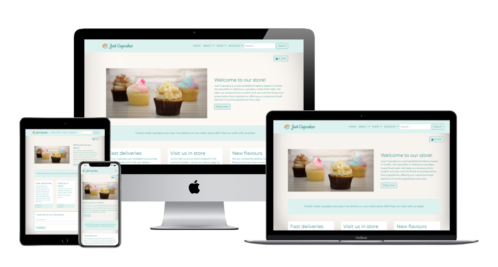

# Just Cupcakes

[View deployed site here](https://just-cupcakes.herokuapp.com/)

Just Cupcakes is a well established bakery based in Dublin. The bakery specializes in high quality cupcakes and offers deliveries everywhere in Ireland. Customers can place orders online, register for an account to have access to a personalised profile page where they can review past orders and save their shipping information for future orders. Store employees can manage product creation, update and cancellation via the website. 

## UX
---

### The ideal client for this website: 

- Is based in Ireland.
- Businesses or individuals who are looking for cupcakes deliveries.

### Visitors to this website are searching for: 

- A bakery located in Dublin.
- A bakery that offers online purchases and deliveries in Ireland. 
- A bakery that specializes in cupcakes.  

### User stories

I have used Github issues and excel as Agile tools. Link to excel file [here](readme-testing-images/User-Stories.xlsx).

Home and about pages

- As a Site User I want to be presented with a well displayed home page, the information is laid out clearly so that I can navigate the website easily and find what I am looking for. 
- As a Site User I want to be able to view the bakery information, including address and contact details so that I can visit or contact the bakery if I need to. 

Products

- As a Site User I want to be able to easily identify the different cupcake categories so that I can chose the one I am intersted in. 
- As a Site User I want to be able to view a list of the available cupcakes for a specified category so that I can select the ones I want to purchase. 
- As a Site User I want to be able to select a specific cupcake so that I can view the details on that cupcake such as price, description, image.

Authentication and account 

- As a Site User I want to be able to easily register for an account so that I can have access to a personal profile with information on my past purchases.
- As a Site user I want to receive a confirmation email when I register for an account so that I can verify that the registration was successful. 
- As a registered Site User I want to be able to update my address and contact information stored in my profile so that they can be used for future orders. 
- As a Site User I want to be able to login and logout easily so that I can access my personal account information when I need it. 

Search and Sort

- As a Site User I want to be able to sort the list of available cupcakes so that I can view the results ordered by price, popularity, date (able to see newest items).
- As a Site User I want to be able to search the available cupcakes by name and description so that I can find the ones I am interested in. 
- As a Site User I want to be able to easily see what I have searched for and the number of results so that I can quickly decide if what I am looking for is available. 

Order and checkout

- As a Site User I want to be able to select the quantity of an item when making the purchase so that I can order the quantity I need. 
- As a Site User I want to be able to view the items I selected in my bag so that I can see the total price and I can make sure I have selected the correct items and related quantity. 
- As a Site User I want to be able to adjust the quantity of the items in my bag so that I can make the required changes before proceeding with the payment. 
- As a Site User I want to easily enter my payment information so that I can checkout quickly. 
- As a registered Site Use I want to be able to save my payment information when creating an order so that they can be used for a future purchase. 
- As a Site User I want to view an order summary and confirmation after checkout so that I can verify there are no mistakes in my purchase. 
- As a Site User I want to receive a confirmation email after placing the order so that I can verify that the order was successful and I can keep a written record of my purchase. 

Careers

- As a Site User I want to be able to view current job openings so that I can apply for a position I am interested in.
- As a Site User I want to be able to apply for a job position so that I might get an interview for a job I am interested in. 

Admin 

- As a Site Owner I want to be able to add a new product so that it will be available for customers to purchase. 
- As a Site Owner I want to be able to edit an existing product so that I can modify the product's details (description, price, image etc.).
- As a Site Owner I want to be able to delete a product so that it is no longer available for sale. 

### Wireframe mockups

[Desktop Mockups](readme-testing-images/desktop-wireframes)

[Tablet Mockups](readme-testing-images/tablet-wireframes)

[Mobile Mockups](readme-testing-images/mobile-wireframes)

### Faceboob page mockup

[Facebook page](readme-testing-images/facebook-page.pdf)

## Features
---

The header of each page features the website logo and the navigation menu. By clicking on the logo the user is redirected to the home page as it would be expected. The navigation menu is responsive and collapses into a burger menu in smaller screens. The navigation menu shows additional option "Profile" (in Account dropdown) for all authenticated users and additional option "Management" for authenticated Admin users.

Authenticated users will see a button on the top right corner of each page (excluding the authentication related pages). The button shows the total amount for the items currently in the bag. The button is a link, by clicking on it the user will be redirected to the bag page. Next to the button there is a link to the user's profile page. 

The footer on each page features links to social media pages, a link to the company privacy policy and the copyright info.

### Home Page

The home page consists of 4 main sections. We have a top section that contains an image of the bakery produced cupcakes and a short presentation of the bakery, with a call to action button that redirects the customer to the products page. Below this, we have a section highlighting that free deliveries are offered on orders above 50 euro, encouraging the user to make a purchase. 
Just below this, we have 3 cards, each including a call to action. By clicking on the "Go" button in each card, the user is redirected respectively to the products page (all products are returned), the about page and to the products page (filtered to return the monthly cupcake).
Finally, at the bottom of the page we have the Newsletter form, where the user can subscribe for the bakery newsletter. 

### About Page

This page is divided into 3 parts. At the top we have an image of some of the cupckes produced by the bakery. The middle part includes some background information on the company and we can see a picture next to it displaying cupcakes packed for a delivery. 
At the bottom of the page we have the bakery address and contact information, as well as a map so that the user can easily locake the bakery. 

### Products Page

The products page contains a grid of cards, each cards displaying info for a specific a product. Each cards contains a picture of the cupcake (including "popular" where applicable), the name, the price and the category the cupcake belongs to. Admin users will also see 2 buttons on each card, one to edit the product and one to delete the product. These buttons are links that redirect the user respectively to the edit_product and delete_product pages. 

Just above the cards grid, on the left, we have a link to the main products page (all cupcakes) and next to it, the number of items found for a specific selection (the user can select a cupcake category in the "Shop" dropdown menu in the main navigation bar) or for a specific search result (the seach bar is also included in the main navigation menu). In case of a search result, users will also see the term they have searched for. 

Above the cards grid, on the right, we have the sort dropdown menu. Site visitors can use this dropdown to sort the available results by price, date, name and category (ascending or descending order). 

### Product Details Pages

This page shows the product details for the selected cupcake. We have a picture of the product and next to it its details, including sku, name, a tag with the category name (this is a link redirecting to the products page, showing results filtered for that category) and description. Under the description the user can enter the product quantity, either manually or using the plus and minus buttons. Next to the quantity selector, we have the "add to bag" button which will add the product to the customer bag. 
Finally, below this, we have a "Keep shopping" link which redirects the user to the products page. 

### Add Product Page

This page can be accessed via the "Management" link in the main navigation menu. The link is available only to Admin users.
The page contains a form that the bakery employees can use to add new products to the store. 

### Edit Product Page 

This page can be accessed either via the "Edit" link included in the product cards in the main products page or via the "Edit" link included in the product details page. The "Edit" links are available only to Admin users.
The page contains a form that the bakery employees can use to add new products to the store. 

### Delete Product Page

This page can be accessed either via the "Delete" link included in the product cards in the main products page or via the "Delete" link included in the product details page. The "Delete" links are available only to Admin users.
The page contains a message asking the users if they are sure they want to proceed and that the action can't be undone. By clicking on the "Delete Product" button, users will permanently delete a product. 

### Bag page 

The bag page contains a table listing all the items the users added to the bag via the "Add to bag" button on the product details page. The table includes a small image of the product, the name of the cupcake, a quantity selector (user can either enter the quantity manually or click on the plus and minus signs, then click on "update for the change to take effect") and the price.
On the table last raw, we have the total, the delivery cost and the grand total. Just below the table we have a "Keep shopping" link (which redirects the customer to the products page) and a "Checkout" button that will redirect the user to the checkou page.

### Checkout Page 

The checkout page contains a form to collect the customer details for the delivery and to collect the payment information. Authenticated users will also see a checkbox to save their information to their profile so that it can be used for future orders. Non authenticated users will see links to login or register to have the possibility to save their information. 
Next to the form, we have a small table showing users a summary of the bag contents and total. By clicking on the "Place order" button, the order will be created and the customer is redirected to the Success checkout page.  

### Success Checkout Page 

This page features 3 tables: one containing the order details (order number and date), another containing the items purchased and the last one containing the delivery information. At the top of the page we also have a note confirming the email address used to send the order confirmation email.  

### Profile Page 

The profile page can only be accessed by authenticated users (link "Profile" in the "Account" dropdown in the main navigation menu). The page features the user's delivery information (if available) and a list of the past orders. The order numbers in the list are links that redirect to the view_order page, which uses the same template as the checkout success page, the only difference being that an information message pops up when the page opens advising the user that they are looking at a confirmation for a past order. 
Just below the delivery information section, we have an "Update" button, this redirects the user to the edit profile page. 

### Edit Profile 

This page contains a form that allows users to update their current delivery information. 

### Job Postings Page

This page contains a list of all the available job openings for the bakery. For each job opening we have job title, description and experience requirements. The "Apply" button will redirects the users to the application page. 

### Job Aplication Page

The application page includes a form that will allow users to enter their information to apply for a position at the bakery. 

### Features to Implement in future

- Funcionality to handle the stock availability for order fulfillment.
- An option for in-store pickups, so that the customer can place the order online and go to the bakery to pick it up, also avoiding elivery costs. 
- More options in the Management section of the website, allowing store employees to also create new categories, create job posting and access job applications.
- Adding box sizes, currently 1 cupcake box contains 12 units. I would like to add the possibiliy for users to select the size (for example: 6, 12, 18 cupcakes per box). 

## E-commerce business model 

Just Cupcakes is a business to customer (b2c) eCommerce application. While businesses could also make purchases, the website is intended for individual customers who will create single orders. The items sold (deliverables) are products, which the customer can purchase online, via single payment, and have delivered at their location.

## Technologies Used

### Languages

- [HTML5](https://en.wikipedia.org/wiki/HTML5)
- [CSS](https://en.wikipedia.org/wiki/CSS)
- [JavaScript](https://en.wikipedia.org/wiki/JavaScript)
- [Python](https://www.python.org/)

### Database

- [Heroku Postgres](https://www.heroku.com/postgres) - I have used Postgres both during development and for production.

A detailed diagram for the database can be found [here](readme-testing-images/JustCupcakes-database.pdf).

### Storage

- [Cloudinary](https://cloudinary.com/) - I have used Cloudinary to store media and static files.

### Frameworks

- [Bootstrap](https://getbootstrap.com/docs/5.0/getting-started/introduction/) - I have used Bootstrap 5.0.2 which helped me design and build a responsive website.
- [Django](https://www.djangoproject.com/) - I have used Django to build the project. 

### Libraries, tools and online resources used

- [Chrome DevTools](https://developer.chrome.com/docs/devtools/) - Used extensively during development to check responsiveness.
- [Dj-database-url](https://pypi.org/project/dj-database-url/) - A utility to help you load your database into your dictionary from the DATABASE_URL environment variable. 
- [Pyscopg2](https://pypi.org/project/psycopg2/) - this was used as a PostgreSQL database adapter for Python.
- [Django Allauth](https://django-allauth.readthedocs.io/en/latest/overview.html) - Used to handle authentication process.
- [Google Fonts](https://fonts.google.com/) - Used for the website fonts.
- [Gunicorn](https://gunicorn.org/) - Used to deploy the project to Heroku.
- [Jinja](https://jinja.palletsprojects.com/en/3.0.x/) - Jinja templating language was used to display backend data in the templates. This has been used both in the HTML and JavaScript.
- [Django-countries](https://pypi.org/project/django-countries/) - A Django application that provides country choices for use with forms, flag icons static files, and a country field for models.
- [Django-autoslug](https://django-autoslug.readthedocs.io/en/latest/) - a Django library that provides an improved slug field which can automatically populate itself from another field. 
- [Stripe](https://stripe.com/) - Used to handle payments for the online purchases. 
- [JQuery](https://jquery.com/) - JavaScript library, used throughout the project to write JavaScript.
- [Pillow](https://pillow.readthedocs.io/en/stable/) - a Python Imaging Library, it was used to help processing image files to store in the database.
- [favicon.io](https://favicon.io/) - Favicon generator.
- [TechSini](http://techsini.com/multi-mockup/) - multidevice mockup generator. I have used this to generate the preview image of the website.
- [Visual Studio Code](https://code.visualstudio.com/) - IDE used for code editing.
- [Heroku](https://www.heroku.com/home) - Used to deploy the app.
- [Adobe XD](https://www.adobe.com/products/xd.html) - Used to create the wireframes. 

## Testing

Testing information can be found in [TESTING.md](TESTING.md) file.

## Deployment

### Cloning the repository

To clone the repository, follow these steps: 

1. Log into Github and locate the repository for this project: [Paola62010/just-cupcakes](https://github.com/Paola62010/just-cupcakes)
2. Above the list of files, click on _Code_, a dropdown menu is presented with different options.
3. In the Clone with HTTPs section, copy the clone URL for the repository.
4. In your local IDE open the terminal.
5. Change the current working directory to the location where you want the cloned directory to be. 
6. Type _git clone_, and then paste the URL copied earlier (step 3).
7. Press Enter to create your local clone.

Additional information on how to clone a Github repository can be found [here](https://docs.github.com/en/github/creating-cloning-and-archiving-repositories/cloning-a-repository).

### Environment variables and ALLOWED_HOSTS

Create an env.py file. The following variables are required for this project:
- SECRET_KEY: any randomly generated key.
- CLOUDINARY_URL: Copy your CLOUDINARY_URL e.g. API Environment Variable from Cloudinary Dashboard (a free account with [Cloudinary](https://cloudinary.com/) is needed for this).
- DATABASE_URL: This is the value of DATABASE_URL in Heroku (step 5 of the next section), located in the Settings Tab, in Config Vars.
- STRIPE_PUBLIC_KEY: your Stripe Publishable key, you will find this in your Stripe dashboard. A free account with [Stripe](https://stripe.com/) is needed for this. 
- STRIPE_SECRET_KEY: your Stripe Secret key, you will find this in your Stripe dashboard. A free account with [Stripe](https://stripe.com/) is needed for this.
- STRIPE_WH_SECRET: your Stripe Webhook secret, you will receive this when you setup an endpoint for webhooks on Stripe. A free account with [Stripe](https://stripe.com/) is needed for this.
- EMAIL_HOST_USER: your email host user. 
- EMAIL_HOST_PASS: your email host password.

In settings.py make sure to correct the ALLOWED_HOSTS values to use your localhost and Heroku app name.

### Deploying to Heroku

To deploy to Heroku follow these steps: 

1. Log into [Heroku](https://dashboard.heroku.com/apps) and locate the "New" button, on the top right end side of your dashboard page. 
2. Click on "Create new app", select your region and pick a name for your project. 
3. On top of the next page there is a navigation bar, select "Settings". 
4. In "Settings" add buildpack Python.
5. Add Database to App Resources. This is located in the Resources Tab, Add-ons, search and add e.g. "Heroku Postgres". 
6. In the Settings Tab, in Config Vars, make sure you have the DATABASE_URL added with the previous step and to add the other variables. Make sure you have the same variables here and in your env.py.
7. On the navigation bar on top of the page, select now "Deploy".
8. Select deployment method "Github" and seach for your repository. 
9. Proceed to link the Heroku app to the repository by clicking on "Connect". 
10. Click on Deploy.

## Credits

### Code

The following articles helped me with my code:

- [How to add favicon to Django in 4 steps](https://simpleit.rocks/python/django/django-favicon-adding/)

### Content

Cupcakes descriptions were taken from [Sally's Baking Recipes](https://sallysbakingaddiction.com/)

### Media

All images for the website have been taken from [Unsplash](https://unsplash.com/)

### Acknowledgements

Thank you to Code Institute, the tutors and my mentor for putting up with my questions and pointing me in the right direction.
