# Just Cupcakes - Testing Details

[Main README.md file](README.md)

[Deployed site](https://just-cupcakes.herokuapp.com/)

The following validators were used to check the validity of the website code:

[W3C Makup Validation Service](https://validator.w3.org/)

[W3C CSS Validation Service](http://jigsaw.w3.org/css-validator/)

[JSHint](https://jshint.com/)

[PEP8online](http://pep8online.com/)

No errors are returned for HTML, JavaScript and CSS. 

For Python, there are 5 errors for "line too long" in the settings.py file, which I did not correct in order not to break the code (errors are for AUTH_PASSWORD_VALIDATORS and STATICFILES_STORAGE). I don't think there is a way to correct these without breaking the code (the AUTH_PASSWORD_VALIDATORS were already set by Django). 

## User Stories Testing 

User stories can be found in the UX section in the [README.md file](README.md)

Home and about pages

- As a Site User I want to be presented with a well displayed home page, the information is laid out clearly so that I can navigate the website easily and find what I am looking for.

        i. The home page has a simple but effective layout, there are clear calls to action and the user is not presented with too much information that could be confusing and cause lack of interest. 

        ii. There is a clear navigation menu at the top of the page that allows the users to easily navigate thought the website and find what they are searching for. 

- As a Site User I want to be able to view the bakery information, including address and contact details so that I can visit or contact the bakery if I need to. 

        i. By clicking on the "About us" link from the "About" dropdown menu in the main navigation bar, the user is redirected to the About page, where the bakery information is displayed. 

Products

- As a Site User I want to be able to easily identify the different cupcake categories so that I can chose the one I am intersted in. 

        i. Site users can identify the different cupcakes categories by clicking on the "Shop" dropdown in the main navigation menu, they are then presented with the 3 available categories and an option so see all products for all categories. 

- As a Site User I want to be able to view a list of the available cupcakes for a specified category so that I can select the ones I want to purchase. 

        i. By clicking on one of the categories on the "Shop" dropdown in the main navigation bar, users are redirected to the products page where they can view the available products for the selected category.

        ii. At the top left corner of the page, users will also see how many products are avilable for that category and the category name itself.

- As a Site User I want to be able to select a specific cupcake so that I can view the details on that cupcake such as price, description, image.

        i. By clicking on the picture of any of the products shown in the products page, the user is redirected to the product details page. 

        ii. On the product details page the user is presented with all the information on the selected cupcake, such as name, category, price, description, sku and the cupcake picture. The text "popular" will be displayed next to the cupcke name if the store owners have turned that option. 

Authentication and account 

- As a Site User I want to be able to easily register for an account so that I can have access to a personal profile with information on my past purchases.

        i. The website has an authentication process and users have the possibility to create an account and have access to a personalised profile page. 

- As a Site user I want to receive a confirmation email when I register for an account so that I can verify that the registration was successful. 

        i. Users who register for an account will receive a verification email to their email address. 

        ii. Users are required to complete the verification process in order for them to be able to access the website with their credentials.

- As a registered Site User I want to be able to update my address and contact information stored in my profile so that they can be used for future orders. 

        i. Registered users have access to a personalised profile page that they can access by clicking on "Profile" from the "Account" dropdown in the main navigation menu. 

        ii. In the profile page, users can view their current address and contact information and have the possibility to update them if needed. 

- As a Site User I want to be able to login and logout easily so that I can access my personal account information when I need it. 

        i. Users cn easily login and logout by clicking on the options in the "Account" dropdown in the main navigation menu. 

        ii. Users who logout are presented with a message asking them to confirm that they would like to logout. 

Search and Sort

- As a Site User I want to be able to sort the list of available cupcakes so that I can view the results ordered by price, date, name and category.

        i. On the products page, users will find a sort dropdown menu on the top right corner of the page. 

        ii. In th dropdown, users will see the options to sort the available results by price, date, name and category, in both descending or ascending order.

- As a Site User I want to be able to search the available cupcakes by name and description so that I can find the ones I am interested in. 

        i. There is a seach bar in the main navigtion menu that allows users to search for products. 

        ii. The results returned will have the term the user has searched for in either the name of the cupcake or in the description. 

- As a Site User I want to be able to easily see what I have searched for and the number of results so that I can quickly decide if what I am looking for is available. 

        i. The results of the search will be displayed in the products page, along with the number of results found and the term that the user has searched for. 

Order and checkout

- As a Site User I want to be able to select the quantity of an item when making the purchase so that I can order the quantity I need. 

        i. On the product details page, users have the possibility to select the quantity for the selected products. Default quantity is 1. 

        ii. Users can either enter the quantity manually or click on the plus and minus signs. 

- As a Site User I want to be able to view the items I selected in my bag so that I can see the total price and I can make sure I have selected the correct items and related quantity.

        i. On the top right corner of every page (except for the authentication pages), there is a button that displays the total amount for the items in the bag. By clicking on the button, users are redirected to the bag page.

        ii. In the bag page, users will see a table listing all the items currently in the bag. 

        iii. For each item, users will see the picture of the product, the name, the price, the quantity and the subtotal. 

- As a Site User I want to be able to adjust the quantity of the items in my bag so that I can make the required changes before proceeding with the payment. 

        i. Users have the possibility to update the product quantity in the bag page. They can enter the quantity manually or by clicking on the plus and minus signs. 

        ii. Once the desired quantity has been selected, the user can click on the "Update" link just under the quantity selector and the quantity and related price will be updated. 

- As a Site User I want to easily enter my payment information so that I can checkout quickly. 

        i. When clicking on the "Checkout" button in the bag page, users are redirected to the checkout page. 

        ii. In the checkout page, users are presented with a form where they can enter their shipping information and payment information. 

- As a registered Site Use I want to be able to save my delivery information when creating an order so that they can be used for a future purchase. 

        i. Authenticated users will see a checkbox in the checkout page that will allow to save their delivery information to their profile so that it can be used for future orders. 

- As a Site User I want to view an order summary and confirmation after checkout so that I can verify there are no mistakes in my purchase. 

        i. By clicking on the "Place order" button on the checkout page, an order will be created (if the form is valid) and the user is redirected to the success checkout page. 

        ii. On the success checkout page, users will see a summary of the items purchased, the order details (order number and date) and the delivery information.  

- As a Site User I want to receive a confirmation email after placing the order so that I can verify that the order was successful and I can keep a written record of my purchase. 

        i. A confirmation email will be sent to the customer when an order is created. 

Careers

- As a Site User I want to be able to view current job openings so that I can apply for a position I am interested in.

        i. By clicking on the "Careers" link in the "About" dropdown in the main navigation menu, users will be redirected to the job openings page. 

        ii. On the job openings page, users will see a list of the available job positions that they can apply for. 

- As a Site User I want to be able to apply for a job position so that I might get an interview for a job I am interested in. 

        i. By clicking on the "Apply" button in the job posting, users will be redirected to the application page. 

        ii. On the application page users are presented with a form that they can use to enter their information and submit their application. 

Admin 

- As a Site Owner I want to be able to add a new product so that it will be available for customers to purchase. 

        i. Admin users have an additional option in the main navigation menu, "Management", by clickin on this link they are redirected to the add product page. 

        ii. On the add product page, Admin users will see a form that will allow them to create a new product to be added to the store. 

- As a Site Owner I want to be able to edit an existing product so that I can modify the product's details (description, price, image etc.).

        i. Admin users have the ability to edit an existing product by clicking on the "edit" links that are displayed in both the product cards in the product page or in the product details page for a specific product. 

        ii. By clicking on the "edit" link, Admin users are redirected to the edit product page where they are presented with a form that will allow them to update the existing details for a product. 

- As a Site Owner I want to be able to delete a product so that it is no longer available for sale. 

        i. Admin users have the ability to delete an existing product by clicking on the "delete" links that are displayed in both the product cards in the product page or in the product details page for a specific product. 

        ii. By clicking on the "delete" link, Admin users are redirected to the delete product page where they are presented with a message asking them if they are sure they want to delete the product. By clicking on "Delete product" the selected product will be permanently deleted. 

## Manual Testing 

### Navigation menu and footer 

1. Navigation menu 

- Verify that on smaller screens the main navigation menu collapses into a burger menu. 

- Click on the logo on the left side of the navigation menu and verify that you are redirected to the home page. 

- For non authenticated users, verify that the "Account" dropdown only contains options "login" and "registered".

- For authenticated users, verify that the "Account" dropdown contains only options "profile" and "logout".

- For authenticated Admin users, verify that the main navigation menu also has option "Management". 

- Click on all the links in the navigation menu (first as a normal user then as an Admin) and verify that you are redirected to the correct pages. 

- On the search field, leave the field empty and click on the "search" button. Verify that an error is displayed advising to fill the required field. 

- Enter something in the search field (for example: chocolate) and click on the "search" button. Verify that you are redirected to the products page. 

2. Footer 

- Hover over the links in the footer and verify that they change color. 

- Click on each of the social media links and verify that you are redirected (in a new page) to the correct social media pages. 

- Click on the "privacy policy" link and verify that you are redirected (in a new page) to the privacy policy for Just Cupcakes. 

### Authentication

1. Registration 

- Click on the "Account" dropdown in the main navigation menu and verify that only options "Login" and "Register" are displayed.

- Click on "Register" and verify that you are redirected to the sign up page. 

- Try to submit the sign up form without filling the required information and verify that the form is not submitted and a message is shown asking to fill in the required fields.

- Try to submit the form with invalid input, for example incorrect email format, and verify that the form is not submitted and a message is shown pointing to the issue. 

- Try to submit the form with invalid pasword (4 digits password for example, which is too short) and verify that an error message is shown pointing to the issue. 

- Try to submit the form with an email address that already has an account and verify that an error message is displayed pointing to the issue. 

- Fill in all the required fields with correct details and verify that you are redirected to the confirm email page where a message is shown advising on the verification process.

- Check your email inbox and verify that that you have received an email with the verification link. Click on the verification link and check that you are redirected to the confirm email page. 

- In the confirm email page, click on th confirm button and verify that you are redirected to the login page and that a success message is displayed on top of the page. Proceed to login. 

2. Login

- Click on the "Account" dropdown in the main navigation menu and verify that only options "login" and "register" are displayed.

- Click on "login" and verify that you are redirected to the login page. 

- Try to submit the login form with incorrect credentials and verify that the form is not submitted and an error is displayed pointing to the issue. 

- Now submit the form with correct credentials and verify that you are redirected to the home page. 

- Verify that now you are able to see a link with your username next to the bag button on the top right corner of the page. 

- Click on the "Account" dropdown in the main navigation menu and verify that now you see options "profile" and "logout".

- If you an Admin user, verify that now the main navigation menu is also displaying the "Management" option.

3. Logout 

- Click on the "Account" dropdown in the main navigation menu and verify that only options "Profile" and "Logout" are displayed. 

- Click on the "logout" link in the "Account" dropdown menu and verify that you are redirected to the logout page. 

- Verify that a message is displayed asking to confirm whether you would like to log out. 

- Hover over the "sign out" button and verify that it changes colour. Click on it and verify that you are redirected to the home page, the link displaying your username next to the bag button is no longer available. 

### Home Page

1. Bag button 

- Hover over the bag button and verify that it changes color. 

- Click on the bag button on the top right corner of the page and verify that you are redirected to the bag page. 

2. Welcome section 

- Just below the company overview which is next to the cupcakes image, you will see a "shop now" button. Hover over the button and verify that it changes color. 

- Click on the button and verify that you are redirected to the products page. 

3. Call to action cards

- Below the welcome sections you will see 3 cards, each containing a call to action and a button. Hover over the buttons and verify that they change color.  

- "Fast deliveries" card: click on the "Go" button and verify that you are redirected to the products page, which will be displaying all products. 

- "Visit us in store" card: click on the "Go" button and verify that you are redirected to the about page.

- "New flavours" card: click on the "Go" button and verify that you are redirected to the products page, which will be displaying only one result for the monthly cupcake. 

4. Newsletter form

- At the bottom of the page you will find the newsletter form. Hover over the button and verify that it change color. 

- Click on the "Subscribe" button without entering anything and verify that an error is displayed asking to fill in the required field. 

- Now try submitting the form with an invalid email address format and verify that an error is displayed pointing to the issue. 

- Try submitting the form with a valid email address and verify that a success message appears confirming that you have subscribed. 

#### Home Page finished site 

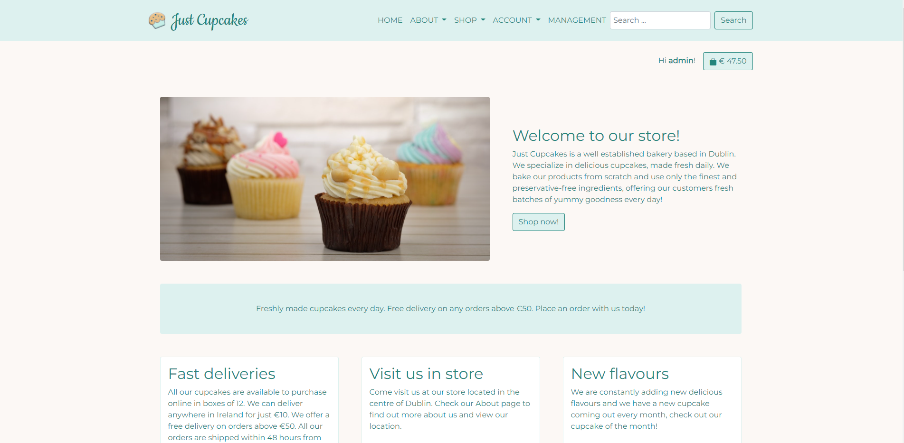
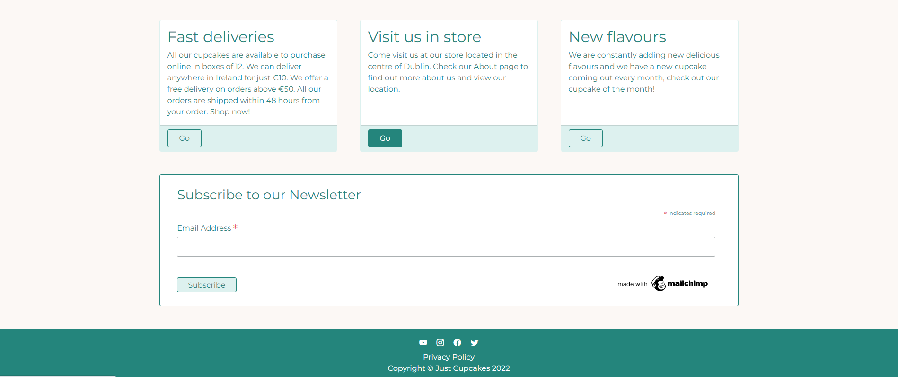

### About Page

1. Bag button 

- Hover over the bag button and verify that it changes color. 

- Click on the bag button on the top right corner of the page and verify that you are redirected to the bag page. 

2. Map 

- At the bottom of the page there is map displaying the bakery's location. Check that the map is pointing to the correct address. 

- Click on the plus and minus signs and verify that you can zoom in and out. 

- Click and drag on the map and verify that you are able to move the map. 

- Click on the "view larger map" and "directions" links and verify that you are redirected to Google maps on a separate page. 

- Click on the small quare on the bottom left corner on the map ("show satellite imagerys") to change to satelite view. 

#### About Page finished site 

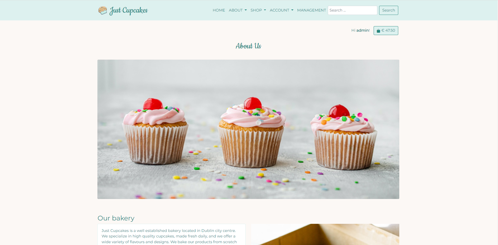
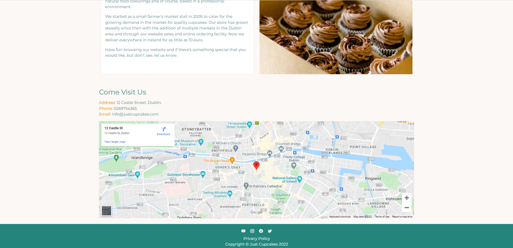

### Products Page

1. Bag button 

- Hover over the bag button and verify that it changes color. 

- Click on the bag button on the top right corner of the page and verify that you are redirected to the bag page. 

2. Product cards grid

- On the main navigation menu, click on the "shop" dropdown and click on all the available options ("classic flavours", "limited editions", "monthly cupcake", "all cupcakes").

- Verify that each time the products returned on the products page match the selected category ("all cupcakes" will return all products). 

3. Products link 

- Just above the product cards grid, there is a "Products" link. Click on it and verify that it redirects to the products page returning all products. Verify that the number of products is shown next to the link.  

- When selecting a cupcake category, verify that next to the link you can also see the category name in addition to the number of products. 

- Go to the search bar in the main navigation menu and perform a seach (for example: "coffee"). Verify that next to the link you can also see the term you have searched for in addition to the number of products. 

4. Product card

- Hover over the cards and verify that the card body changes color. 

- Verify that for each products you can see the name, price and category tag. 

- Click on the product image and verify that you are redirected to the product details page for the selected cupcake. 

- Verify that the text "popular" is displayed on the picture of the applicable cupcakes (this will be shown if the popular checkbox has been selected during product creation or update). 

5. Sort dropdown

- Above the product cards grid, on the right, we can see the sort dropdown menu. 

- Click on the menu and select price, first in ascending then descending order, and verify that the products are displayed accordingly. 

- Click on the menu and select date, first in ascending then descending order, and verify that the products are displayed accordingly. 

- Click on the menu and select name, first in ascending then descending order, and verify that the products are displayed accordingly. 

- Click on the menu and select category, first in ascending then descending order, and verify that the products are displayed accordingly. 

#### Products Page finished site 

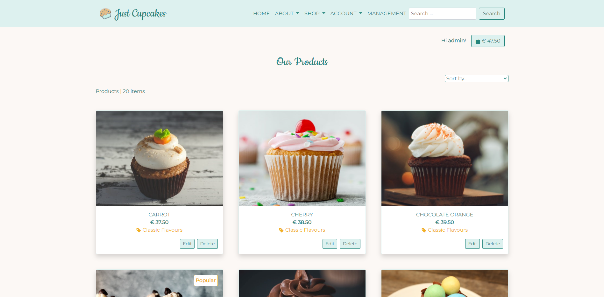
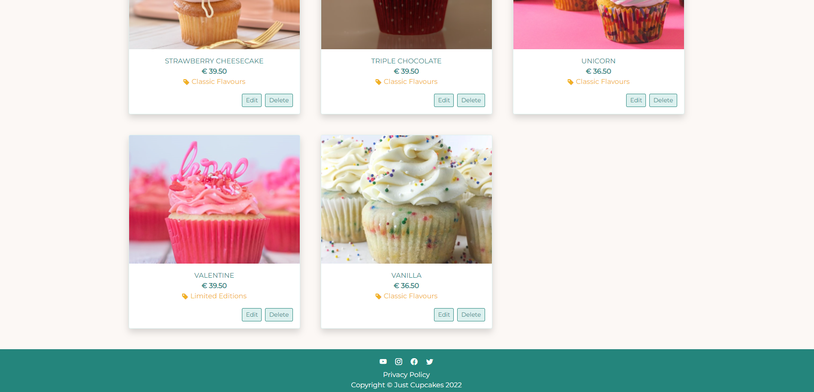

### Product Details Page

1. Bag button 

- Hover over the bag button and verify that it changes color. 

- Click on the bag button on the top right corner of the page and verify that you are redirected to the bag page. 

2. Product details 

- Verify that the product information is displayed correctly and includes the name, sku, price, description and category tag. 

- Click on the category tag and verify that you are redirected to the products page which displays all products for that specific category. 

- Below the price description we can see the quantity selector. Verify that the quantity is 1 by default. Click on the plus and minus signs and verify that the quantity is increased and decreased respectively. 

- Verify that the minus sign button is greyed out when the quantity is 1. Verify that the plus sign button is greyed out when the quantity is 10. 

- Enter the quantity manually and try to add a value that is less than 1 or more than 10. Verify that you get an error message advising that the value should be greater or equal than 1, or less or equal than 10.

- Hover over the "add to bag" button and verify that it changes color. Click on the button and verify that a success message appears and that the amount shown in the bag button has been updated correctly. 

- Click on the "keep shopping" link below the quantity selector and verify that it redirects to the products page (all products returned).

#### Products Details Page finished site 

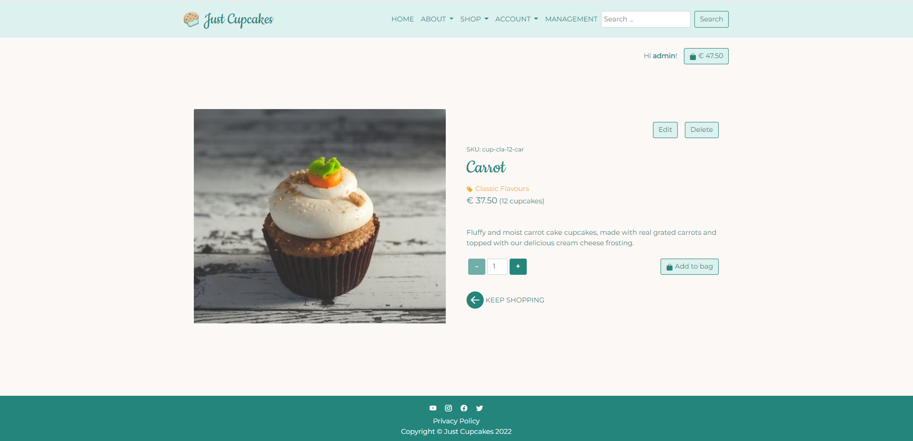

### Add Product Page

1. Bag button 

- Hover over the bag button and verify that it changes color. 

- Click on the bag button on the top right corner of the page and verify that you are redirected to the bag page. 

2. Add product form 

- Try to submit the form without filling in the required fields. Verify that the form is not submitted and that a message is displayed asking to fill in the required fields. 

- Try to submit the form with an invalid price (over 6 digits). Verify that the form is not submitted, a generic error message is displayed on top of the page and a more specific error is returned below price field. 

- Now submit the form with all the required details and valid inputs. Verify that a success message appears on top of the page and that you are redirected to the product details page displaying the product you have just created. 

3. Test role access

- As a non authenticated user, try to access this page by manually entering the url. Verify that you are redirected to the login page. 

- Login as a non admin user and try to access the Url again (https://just-cupcakes.herokuapp.com/store/add_product/). Verify that you are redirected to the home page and that an error message appears on top of the page advising that you do not have privileges to visit this page. 

#### Add Product Page finished site 

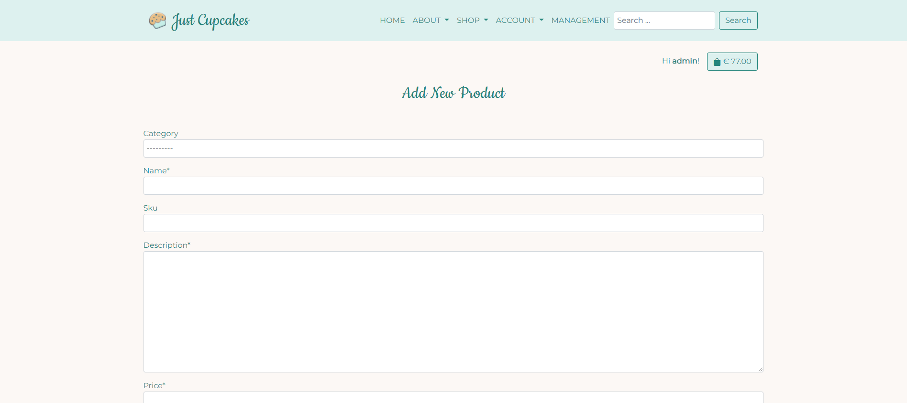
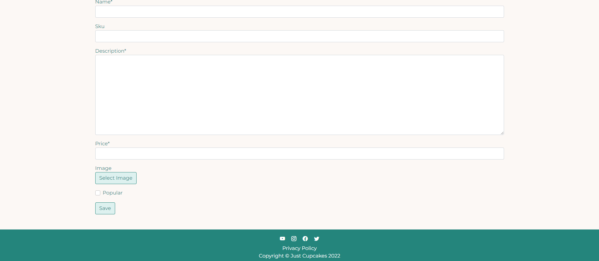

### Edit Product Page

1. Bag button 

- Hover over the bag button and verify that it changes color. 

- Click on the bag button on the top right corner of the page and verify that you are redirected to the bag page. 

2. Edit product form

- Try to submit the form removing the inputs in the required fields. Verify that the form is not submitted and that a message is displayed asking to fill in the required fields. 

- Try to submit the form with an invalid price (over 6 digits). Verify that the form is not submitted, a generic error message is displayed on top of the page and a more specific error is returned below price field. 

- Now submit the form with all the required details and valid inputs. Verify that a success message appears on top of the page and that you are redirected to the product details page displaying the product you have just updated.

3. Test role access

- As a non authenticated user, try to access this page by manually entering the url. Verify that you are redirected to the login page. 

- Login as a non admin user and try to access the Url again (as example: https://just-cupcakes.herokuapp.com/store/edit_product/cherry/). Verify that you are redirected to the home page and that an error message appears on top of the page advising that you do not have privileges to visit this page. 

#### Edit Product Page finished site 

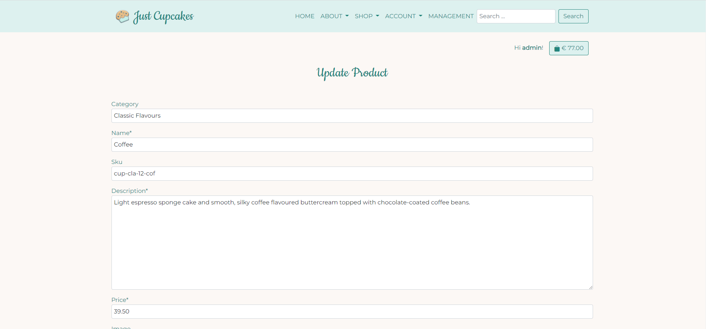
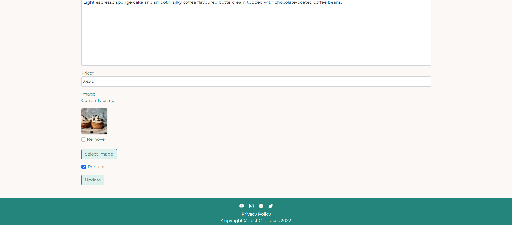

### Delete Product Page

1. Bag button 

- Hover over the bag button and verify that it changes color. 

- Click on the bag button on the top right corner of the page and verify that you are redirected to the bag page. 

2. Delete product form 

- Click on the "delete product" button. Verify that you are redirected to the products page and that a success message appears on top of the page. 

- Verify that the product you have deleted is no longer displayed on the products page. 

3. Test role access

- As a non authenticated user, try to access this page by manually entering the url. Verify that you are redirected to the login page. 

- Login as a non admin user and try to access the Url again (as example: https://just-cupcakes.herokuapp.com/store/delete_product/cherry/). Verify that you are redirected to the home page and that an error message appears on top of the page advising that you do not have privileges to visit this page. 

#### Delete Product Page finished site 

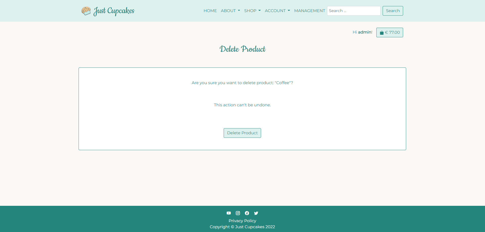

### Bag page 

1. Bag button 

- The bag button is present on the bag page as well, showing the amount of the items in the bag, but in this case it is not a link to the bag page as we are already there. 

2. Bag table

- If the bag is empy, verify that you are presented with a message informing you that the bag is currently empty, and a "keep shopping" button. Click on the "keep shopping" button and verify that it redirects to the products page (all products returned).
 
- If there are products in the bag, verify that the correct information is shown in the table, including: image, product name and price, quantity and subtotal. 

- The quantity field has quantity selector to update the product quantity. Click on the plus and minus signs and verify that the quantity is increased and decreased respectively. 

- Verify that the minus sign button is greyed out when the quantity is 1. Verify that the plus sign button is greyed out when the quantity is 10. 

- Enter the quantity manually and try to add a value that is less than 1 or more than 10. Verify that you get an error message advising that the value should be greater or equal than 1, or less or equal than 10.

- Update the quantity to a valid value and click on the "Update" link. Verify that a success message is displayed, the prices in the table and in the bag button are updated correctly. 

- Under the subtotal for each item, we have a "bin" button. Click on the button to remove the item from the bag. Verify that a success message is displyed and that the item is no longer in the bag. 

- If the bag total is less than 50 euro, a delivery cost of 10 euro is applied. Verify that the delivery cost is applied correctly for orders that are less than 50 euro. 

- If the bag total is less than 50 euro, verify that a yellow text appears under the grand total, informing the user on how much more they should spend to get a free delivery. 

- Under the table there is a "keep shopping" button on the left. Click on it and verify that it redirects to the products page (all products returned).

- Under the table, on the right, there is a "checkout" button. Click on it and verify that it redirects to the checkout page. 

#### Bag Page finished site 

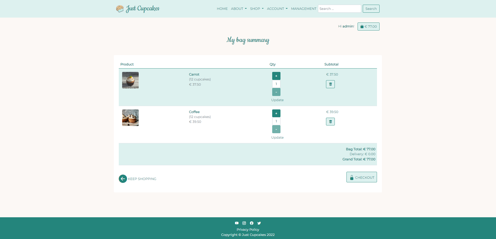

### Checkout Page

1. Bag button 

- Hover over the bag button and verify that it changes color. 

- Click on the bag button on the top right corner of the page and verify that you are redirected to the bag page. 

2. Checkout form

- Verify that as an authenticated user you are able to see the "Save these details to your profile" checkbox. 

- Verify that as a non authenticated user the "Save these details to your profile" checkbox is not available, instead you will see links to login or register. Click on the links and verify that they redirect to the correct pages. 

- Try to submit the form without entering the required fields for the "Order Details" section and verify that the form is not submitted. 

- Try to submit the form with invalid inputs (as example, invalid email format) and verify that the form is not submitted and a message is displayed pointing to the issue.

3. Payment details 

- Try to submit the form without the payment details or with incorrect payment details and verify that an error is displayed. The error message will display, in red, under the card number field.  

- Now submit the form with valid card information. Test using different cards to test different scenarios. Card details can be found [here](https://stripe.com/docs/testing). 

- Test using a card that requires additional authentication (3D Secure authentication section) and verify that a modal from Stripe appears and that you are required to complete authentication to proceed with the payment. 

- Test using cards that will be rejected, as example using the "Generic decline" card. Verify that you are not able to submit the form and that an error message will be returned, in red, under the card field. Test with different cards that will fail to see that the form is not submitted and the relevant message from Stripe is returned. 

- Now test using the card details of a card that will not fail. Verify that you are redirected to the success checkout page and that a success message is displayed. 

- Check your email inbox and verify that you have received an email confirmation for your order. Email should look as below. 

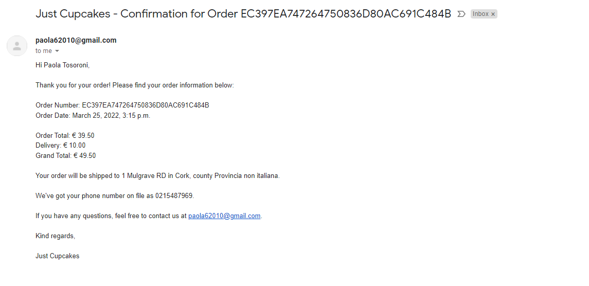

- Create an order as an authenticated user and check the "Save these details to your profile" option. After placing the order, click on the "profile" link on the main navigation menu which will redirect you to the profile page. Verify that the delivery details have been updated correctly. 

- To confirm that webhooks were successful for the transactions you have tested for, go to the Stripe dashboard page, then in the Webhooks section check the results for the Just Cupcakes endpoint. 

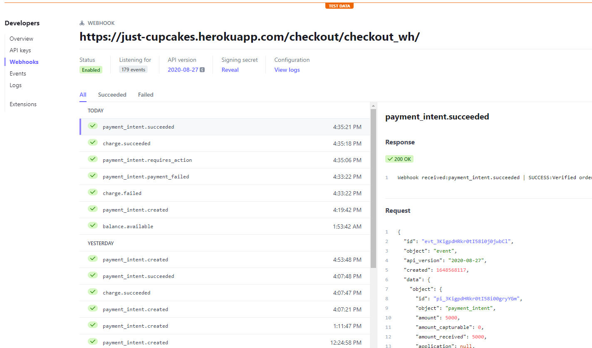

#### Checkout Page finished site 

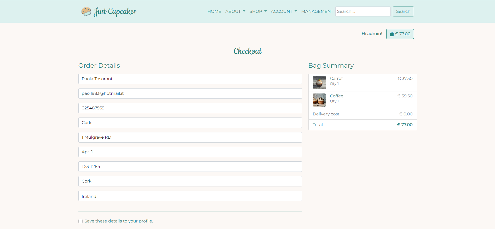
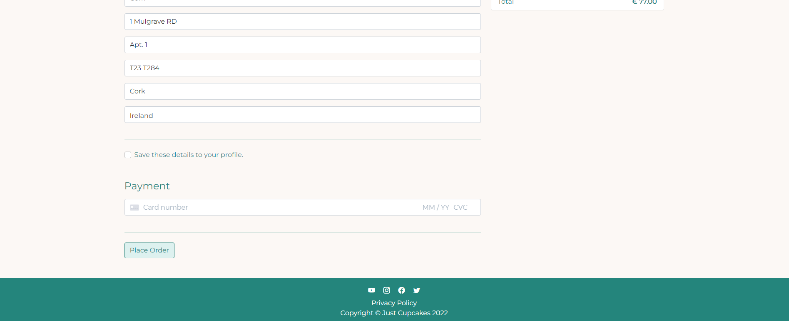

### Success Checkout Page

1. Bag button 

- Hover over the bag button and verify that it changes color. 

- Click on the bag button on the top right corner of the page and verify that you are redirected to the bag page.

2. Order info 

- Verify that your order number and order date are present. 

- Just above the order info details, verify that you can see the email address used to send the order confirmation email. 

3. Purchased 

- Verify that the correct items that you have ordered are listed here. 
 
4. Delivering to

- Verify that the correct delivery information that was entered during the checkout process is displayed here.  

#### Success Checkout Page finished site 

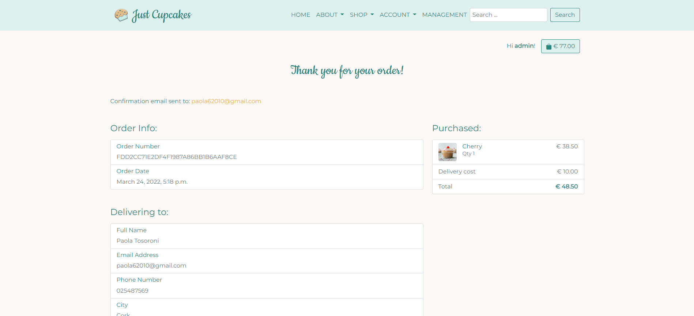
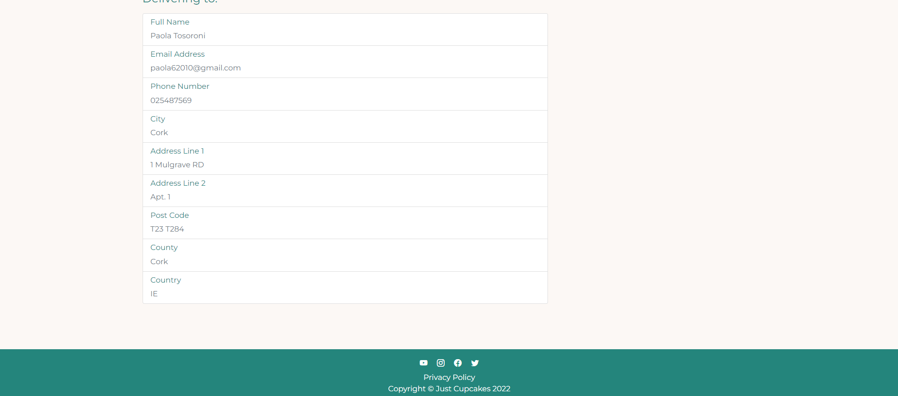

### Profile Page

1. Bag button 

- Hover over the bag button and verify that it changes color. 

- Click on the bag button on the top right corner of the page and verify that you are redirected to the bag page.

2. Default Delivery Info 

- Test with a user that has not saved their delivery information (during the checkout process or via the edit profile page) and verify that all the values are displaying as "(Not set)".

- Test with a user that has saved their delivery info during the checkout process and verify that their default delivery info has been updated accordingly. 

- Just below the "Default Delivery Info", we can see an "Update" button. Hover over it to see it change color like all the buttons on the website. Click on it and verify that you are redirected to the edit profile page. 

3. Past Orders

- Verify that the orders you have placed for a specific user are displayed here. 

- The order numbers are links. Click on them and verify that you are redirected to the "view order" page. This page uses the same template as the checkout success page, the only difference being that an information message pops up when the page opens advising you that you are looking at a confirmation for a past order.

#### Profile Page finished site 

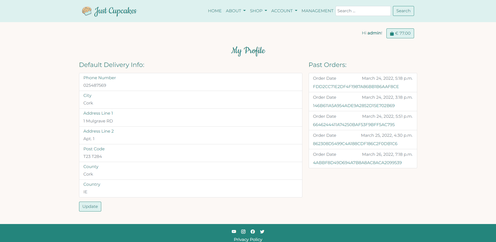

### Edit Profile

1. Bag button 

- Hover over the bag button and verify that it changes color. 

- Click on the bag button on the top right corner of the page and verify that you are redirected to the bag page.

2. Edit profile form 

- Update any of the fields in the form and click on save. Verify that you are redirected to the profile page and that your changes are being displayed correctly. 

#### Edit Profile Page finished site 

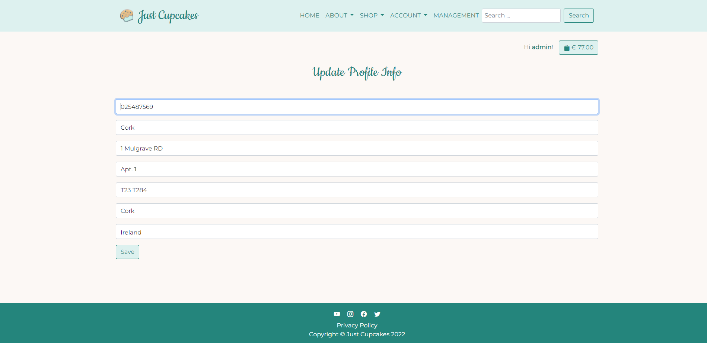

### Job Postings Page

1. Bag button 

- Hover over the bag button and verify that it changes color. 

- Click on the bag button on the top right corner of the page and verify that you are redirected to the bag page.

2. Job postings 

- Verify that for each job posting the following information is displayed: job title, job description and experience. 

- For each job posting there is an "apply" button. Hover over it and verify that it changes color. Click on it and verify that you are redirected to the job application page. 

#### Job Postings Page finished site 

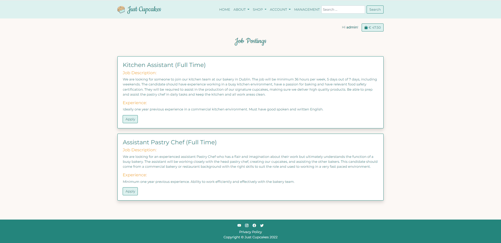

### Job Application Page

1. Bag button 

- Hover over the bag button and verify that it changes color. 

- Click on the bag button on the top right corner of the page and verify that you are redirected to the bag page.

2. Application form 

- Try to submit the form without filling the required fields and verify that the form is not submittd, an error will show advising to fill in the required fields. 

- Try to submit the form with an invalid email input. Verify that the form is not submitted and that an error is displayed pointing to the issue. 

- Now fill in all the required field with correct values and click on the "submit" button. Verify that you are redirected to the job postings page and that a success message appears on top of the page. 

#### Job Application Page finished site 

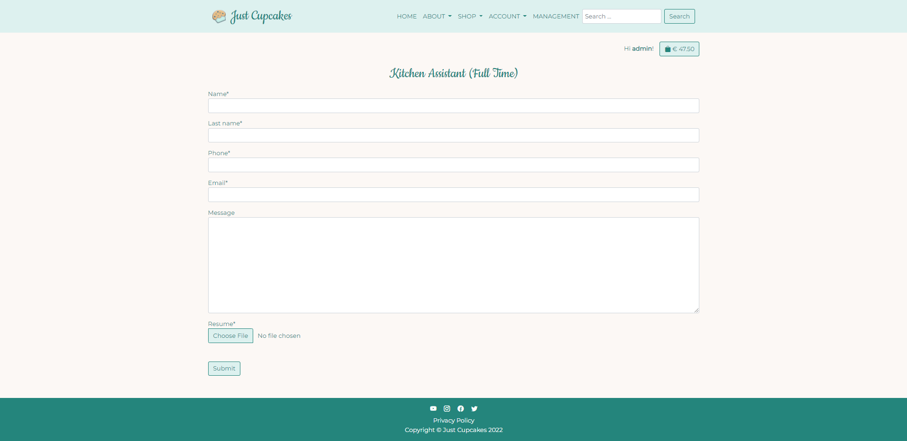

## Bugs 

There was an issue in the forms for the Add Product and Edit Product pages which allowed product creation and update without the product image. This would then result in error "The 'image' attribute has no file associated with it" when visiting the Products page, as there were products with no images (which I had created to test the forms). The error was caused by a mistake in my forms.py file, where I had attribute "required" set as False for Image. This should have been True as the image is required as per my Product model. 

### Remaining bugs

The only remaining issue I have noticed is in the form located in the job application page. This is not really a bug but more of a limitation. If the file uploaded for the resume is a pdf file, the form is submitted successfully, and the file name can be seen in the database, in fact if I check the django admin panel the file name is visible. However, the file cannot be opened. This is due to the fact the Cloudinary requires a paid account to host pdf files, and my account is a free account. 

## Additional Testing 

- Site was tested in different browsers and works nicely in all of them: Google Chrome, Safari, Firefox, Microsoft Edge.

- Used different devices for testing including: MacBook Pro, iPad, iPhone 11 Pro and HP Pavillion Notebook. Latest operating system installed on all devices. 

- Extensive use of Google Chrome DevTools to test site perormance and responsiveness. 
